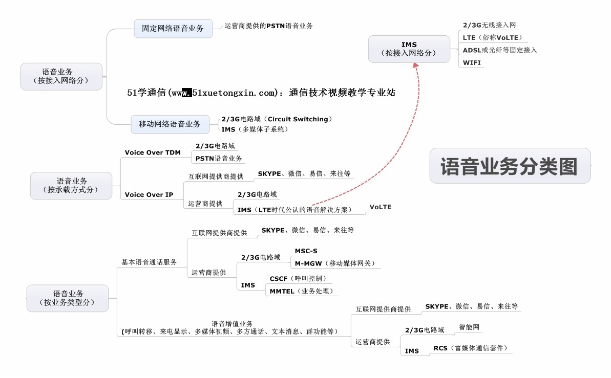

### 什么是IMS

	IMS、VOIP、VoLTE、RCS这几个概念对一些初学者来说总是分不太清楚，但出镜的频率又很高。
	这几个概念到底有哪些区别和联系呢？本视频将为您进行深入讲解。

	IMS是IP多媒体子系统（IP Multimedia Subsystem）的缩写
		基于IP承载网
		SIP协议作为核心控制协议，媒体面（用户层面）使用RTP
		提供与接入无关的IP多媒体业务控制能力
			支持多种接入形式：
				移动网：WiMax、LTE/SA、GSM/WCDMA、CDMA/TD-SCDMA
				固定网：LAN、WLAN、xDSL
			提供IP多媒体业务：
				会话类业务：语音会话与视频会话、多媒体会议、消息与呈现
				非会话类业务：IPTV、媒体、WEB与IMS融合业务

### 分类

	语音业务（按接入网络分）：
		固定网络语音业务：运营商提供的PSTN语音业务
		移动网络语音业务：2/3G电路交换域（Circuit Switching）、IMS（多媒体子系统）

	语音业务（按承载方式分）：
		Voice over TDM：2/3G电路交换域、PSTN语音业务
		Voice over IP：互联网提供商提供（Skype、微信、易信等）、运营商提供（2/3G电路域、IMS（LTE时代公认的语音解决方案（VoLTE）））

	语音业务（按业务类型分）：
		基本语音通话服务（互联网提供商提供（Skype、微信、易信等）、运营商提供（2/3G电路域（MSC-S、M-MGW（移动媒体网关））、IMS（CSCF（呼叫控制）、MMTEL（业务处理））））
		语音增值业务（呼叫转移、来电显示、多媒体视频、多方通话、文本消息、群功能等）（互联网提供商提供（Skype、微信、易信等）、运营商提供（2/3G电路交换域、IMS（RCS（富媒体通信套件））））

	IMS（按接入网络分）：
		2/3G无线接入网
		LTE（俗称VoLTE）
		ADSL或光纤等固定接入
		WIFI

	（VoIP（IMS（RCS）））
	IMS+LTE=VoLTE
	LTE网络：eNodeB、MME、SGW、PGW