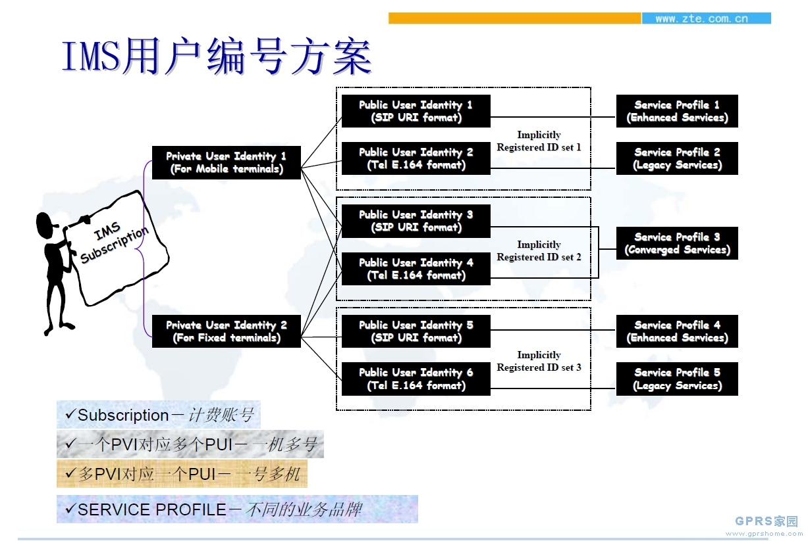
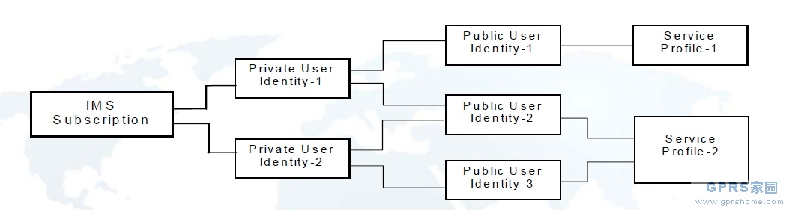

## [其他] IMPU,IMPI,PSI-IMS中几个用户ID

	IMPU：IP Multimedia Public Identity  IP 多媒体公共标识
	IMPI：IP Multimedia Private Identity IP多媒体私有标示
	PSI：Public Service Identity  公用业务标示

	Private user identities-PVI   （类似IMSI， 用来入网接入用）
	? 每个IMS用户有一个或几个PVI。
	? 采用NAI格式
	�C nai = username / ( username “@” realm )）
	? 归属网络运营者提供的唯一全球标识
	? 标识的是签约数据，不是用户

	Public user identities－PUI  （类似MSISDN， IMS中用来拨打的号码，并于签约的应用服务所关联）
	? 每个IMS用户有一个或多个IMPU
	? 用于用户同其它用户的通讯
	? IMPU可以采用SIP URI格式或者"tel:"-URI格式。
	? 终呼时IMPU可以用来在HSS中标识用户数据

	IMPI同IMPU的关系
	?一个IMS签约可以支持多IMS用户。
	?IMPU可以在同一个IMS签约中被多个IMPI共享（一号多机）。
	?尽管一个用户拥有一个或多个共享的IMPU，但是该用户的所有Service Profiles都必须在同一个HSS中

	PSI
	为了在IMS系统中引入标准的呈现、消息、会议等业务， 需要引入公共业务标识PSI （Public Service Identities）。
	? PSI和PUI不同，它们标识的是业务，由AS负责执行。
	如：Gaming@BJ.CHINA.COM
	? 一个本地业务可以通过一个可以全局路由的PSI进行标识，为全网提供服务。