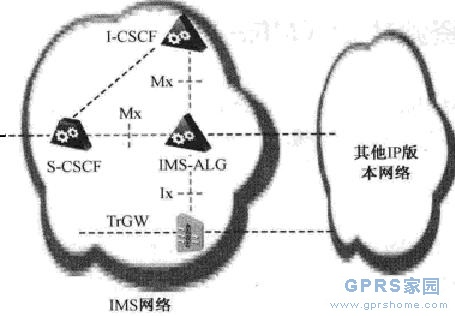

## [网络架构] IMS网络中的IMS-ALG和TrGW

	IMS支持两个IP版本，即IPv4和IPv6。在某些点，IP多媒体会话或者通信会在两个版本间进行交互。为了简化IPv4和IPv6的互操作，而无须终端支持，IMS增加了两个新功能实体，用于对这两个协议进行转换。这些新功能实体就是IMS应用层网关（IMS Application Layer Gateway,IMS-ALG)和转换网关（Transition Gateway,TrGW),前者负责处理控制面信令，即SIP和SDP消息，而后者用于处理媒体面业务，例如，RTP和RTCP。
	下图给出了IMS-ALG和TrGW与IMS其他节点之间的关系。IMS-ALG作为一个SIP B2BUA来维护两个独立的信令段：一个是内部IMS网络，另一个是其他网络。每个信令段分别运行不同的IP版本。此外，IMS-ALG通过将终端产生的IP地址和端口号改变为由TrGW分配的一个或者多个IP地址及端口号来实现对SDP的重写JMS-ALG与TrGW通过Ix接口相连，IMS-ALG与I-CSCF和S-CSCF都通过Mx接口相连，前者作为输入业务，而后者为输出业务。

	TrGW等效为网络地址端口翻译器，协议翻译器（Network Address Port Translator-Protocol Translator,NAT-PT/ANPT-PT)。TrGW配置了一个IPv4地址池，可以对给定的会话进行动态分配。TrGW在媒体层，即RTP和RTCP,实现IPv4和IPv6的转换。3GPP在3GPPTS29.162中对IMS-ALG和TrGW与IPv4和IPv6的交互进行了标准化。