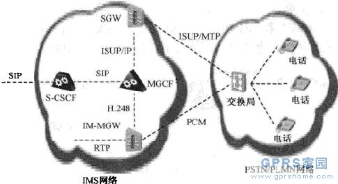

## [网络架构] IMS网络的PSTN_CS网关

	PSTN网关提供与电路交换网的接口，允许IMS终端向PSTN(或其他电路交换网）发起呼叫，或者接收来QPSTN的呼叫。在IMS中，该任务通常由媒体网关控制功能(Media Gateway Control Function,MGCF)来完成。
	图2给出了一个分解的PSTN网关，通过该网关与PSTN进行接口。
	PSTN网关分解为以下功能。
	? 信令网关（Signaling Gateway,SGW)：信令网关与CS网络的信令面接口，SGW执行底层协议转换。例如，SGW负责将底层的MTP用IP上的流控传输协议(Stream Control Transmission Protocol,SCTP)来代替，这样SGW便可以将在MTP上传输的ISUP或者BICC转换成通过SCTP/IP承载的ISUP或BICC。
	?媒体网关控制功能（Media Gateway Control Function,MGCF)：MGCF是PSTN/CS网关的核心节点，它实现协议转换，将SIP协议映射成在IP上承载的ISUP或者BICC。另外，将呼叫控制协议转换成由MGCF来控制的媒体网关(Media Gateway,MGW)中的资源。MGCF和MGW之间的协议是H.248协议。

	?媒体网关（MediaGateway,MGW)：媒体网关是在媒体面上与PSTN或CS网络上的接口。MGW的一侧能够通过RTP协议发送或者接收IMS媒体，另一侧通过一条或者多条PCM连接到CS网络。另外，当IMS终端部支持CS侧的编/解码器时，MGW还执行码型转化功能。通常的场景是IMS终端使用AMR编/解码器，而PSTN终端使用G.711编/解码器。